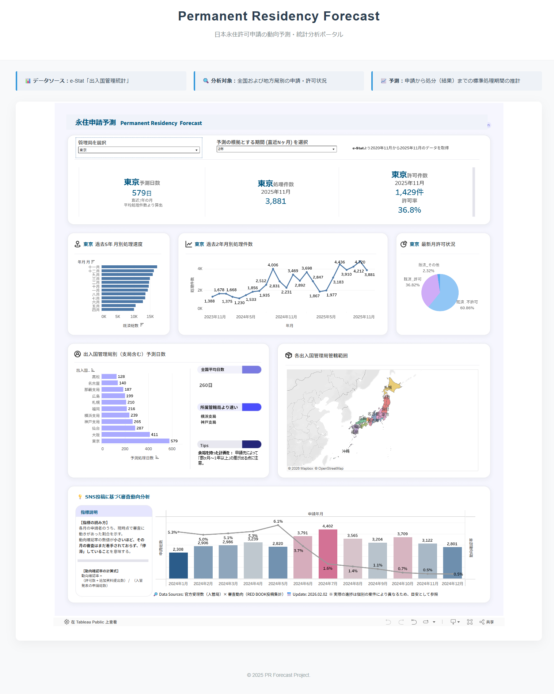
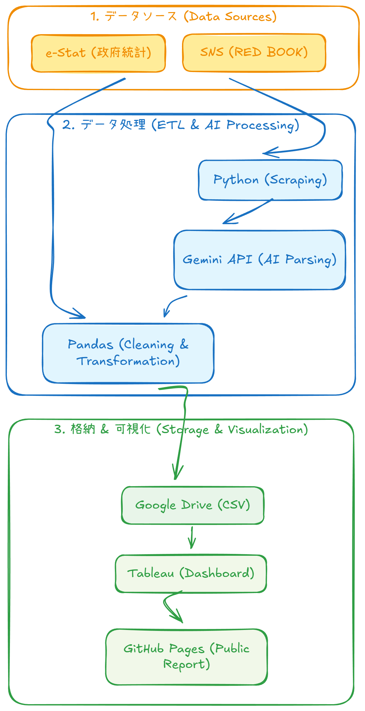

# Permanent Residency Forecast System (Japan)
日本における永住許可申請のトレンド予測と統計可視化システム

## 概要
本プロジェクトは、出入国在留管理庁が公開する「出入国管理統計」のオープンデータと SNS 上の民間動向データを活用し、永住権申請の受理状況や審査のバックログ（未済）を可視化するダッシュボードです。

📸 <b>ダッシュボードのスクリーンショットを表示</b>

 

## データフロー

## 特徴
- **リアルタイム性**: Tableau Public 経由で e-Stat の最新データを反映
- **AI によるデータクレンジング**: **Gemini API** を活用し、SNS 上の非構造化データから審査動向を自動抽出
- **インタラクティブ性**: 過去 12 ヶ月〜60 ヶ月の推移をパラメータで自由に調整可能
- **地域別分析**: 東京、大阪、名古屋など各地方入管局別の詳細なデータを網羅

## 使用技術
- **Data Processing**: Python (Pandas, python-dotenv), **Gemini API**
- **Visualization**: Tableau Desktop / Tableau Public
- **Deployment**: GitHub Pages (HTML/CSS)

